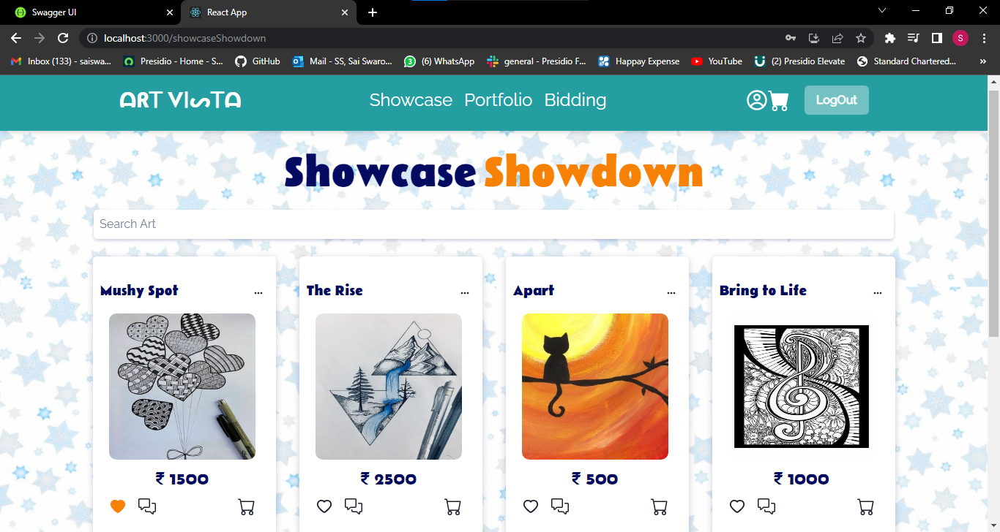
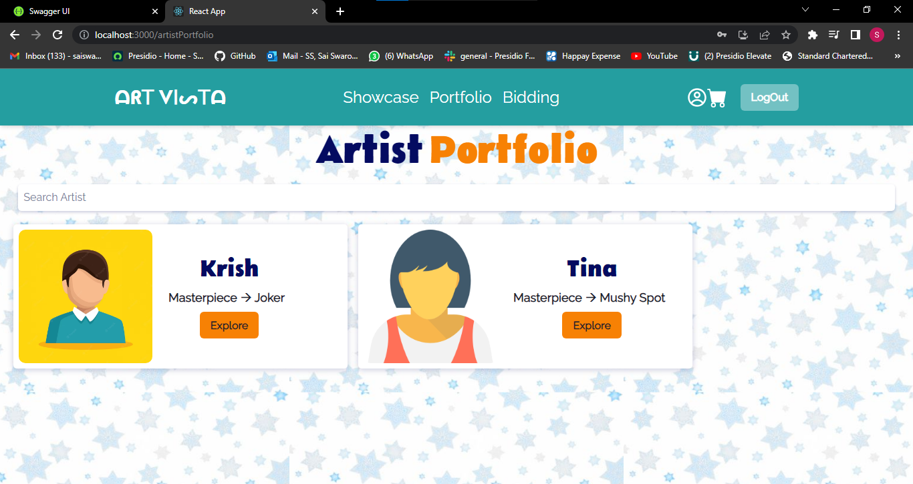
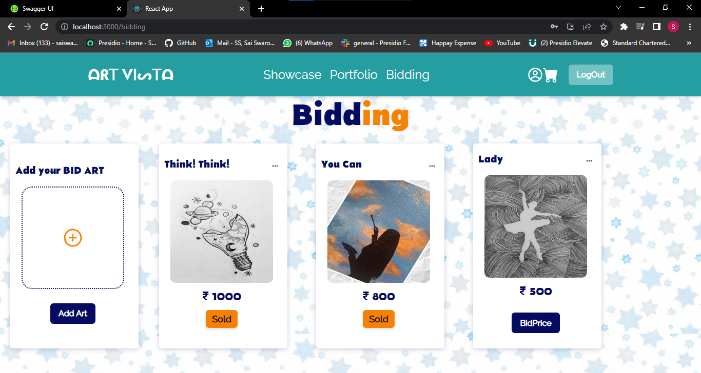
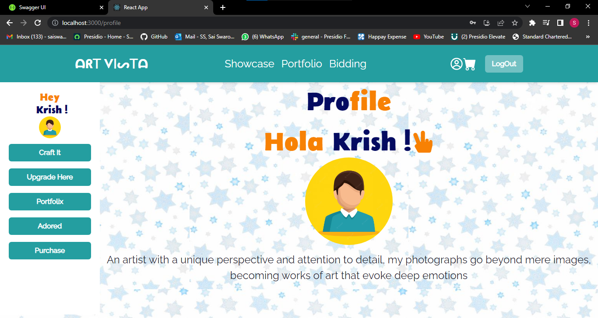

# Capstone Project

# Art Vista 🎨

Art has the power to transcend boundaries and speak to the depths of our souls. At ART VISTA, we believe in celebrating art in all its forms. Join us on this journey as we celebrate the transformative power of art and its ability to inspire and connect us all.

## Tech Stack 💬

**Client:** ReactJS

**Styling:** Chakra UI

**Server:** C#

**Database:** MSSQL

**Background Jobs:** Hangfire

**CI / CD Pipeline:** GitHub Actions

## Features 💬

#### ⚡️ Showcase Showdown

- Discover a captivating showcase of listings, each one a masterpiece waiting to be explored.  
- Browse through a diverse range of high-quality items, each with its own story and allure. 

#### ⚡️ Portfolio

- Explore the captivating artist portfolios, where imagination takes form and colors come alive. 
- Discover the remarkable talents of visionary artists who pour their heart and soul into every stroke.

#### ⚡️ Market Mingle

- The vibrant marketplace where sellers and buyers connect to trade their treasures. 
- Join our community of passionate individuals and experience the joy of connecting with fellow enthusiasts.

#### ⚡️ Bidding

- Engage in exciting bidding wars as users vie for their most coveted treasures. 
- Experience the thrill of competition as you place bids and watch the prices rise. 
- With each bid, you participate in a vibrant community where users demand and appreciate the value of unique and sought-after items.

#### ⚡️ Treasures

- More than just a button, it's an invitation to immerse yourself in a world of artistic brilliance, where each favorite artwork becomes a cherished gem in your personal treasure trove.

#### ⚡️ Comment & Review

- Engage with the art community and express your thoughts on captivating artworks. 
- Leave meaningful comments and provide valuable feedback to support and encourage artists on their creative journey.

## Glimpse ✨

